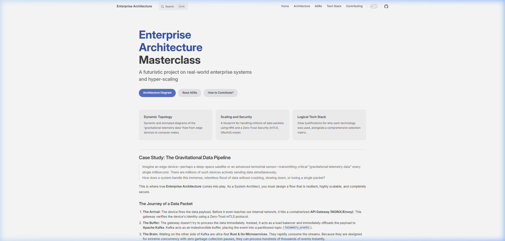

<div align="center">
  <h1>🚀 Awesome System Architecture Masterclass</h1>
  <p><b>A futuristic open-source repository for learning real-world enterprise architecture, system hyper-scaling, and zero-trust security.</b></p>
  
  [](https://github.com/diusazzad/awesome-system-architecture/actions/workflows/deploy.yml)
  [](https://vitepress.dev)
  [](https://opensource.org/licenses/MIT)
  
  <br />
  
  <h3>
    <a href="https://sysarch.zengfy.top/">View Live Documentation</a>
    <span> | </span>
    <a href="#how-to-contribute">Contribute</a>
  </h3>
</div>

---

## 🌟 Overview

This repository is **not a traditional codebase**. It is an interactive **Architectural Masterclass** designed to teach the fundamentals and advanced concepts of designing futuristic, high-performance systems.

Instead of writing application code, we focus on **System Physics**, **Enterprise Topology**, and **Architecture Decision Records (ADRs)**. 

<div align="center">
  <a href="https://sysarch.zengfy.top/">
    
  </a>
</div>

## 📌 Key Features

* **Dynamic Topologies**: Explore real-world data pipelines (e.g., edge devices -> Gateway -> Kafka -> Redis -> Rust/Go -> PostgreSQL) with animated and dynamic Mermaid.js diagrams.
* **Hyper-Scaling Blueprints**: Learn how to scale systems using Horizontal Pod Autoscaling (HPA) and Kafka partitioning to handle millions of data packets with zero lag.
* **Zero-Trust Security**: Deep dive into implementing mTLS, OAuth2, and End-to-End Encryption (E2EE) within microservice architectures.
* **Architecture Decision Records (ADRs)**: Understand the "Why" behind technology choices. Why PostgreSQL over MongoDB? Why Rust/Go over Node.js?

## 📂 Project Structure

All learning materials are structured beautifully into directories and served as a lightning-fast static site.

```text
/
├── architecture/
│   ├── 01_enterprise_topology.md (System Architecture Diagrams)
│   └── 02_scaling_and_threat_modeling.md (Scaling & Security Plans)
├── adrs/ (Architecture Decision Records)
│   ├── 0001_postgresql_for_quantum_state_tracking.md
│   └── 0002_rust_and_go_for_real_time_data_streams.md
├── tech_stack/
│   └── selection_matrix.md (Tech Stack Justifications)
```

## 🤝 How to Contribute

We welcome everyone to participate in this architectural discussion! **You don't need to be an expert coder.** 

1. **Read the Guidelines:** Please check our [Contribution Guidelines](CONTRIBUTING.md) to understand how you can help.
2. **Markdown Only:** If you spot a typo, want to suggest a new architecture diagram, or write an ADR, you can simply edit the `.md` files directly on GitHub and submit a Pull Request!
3. **Discussions:** Use the [GitHub Discussions](https://github.com/diusazzad/awesome-system-architecture/discussions) tab to debate architectural patterns or ask questions.

---

<div align="center">
  <i>Built with ❤️ for the open-source community.</i>
</div>