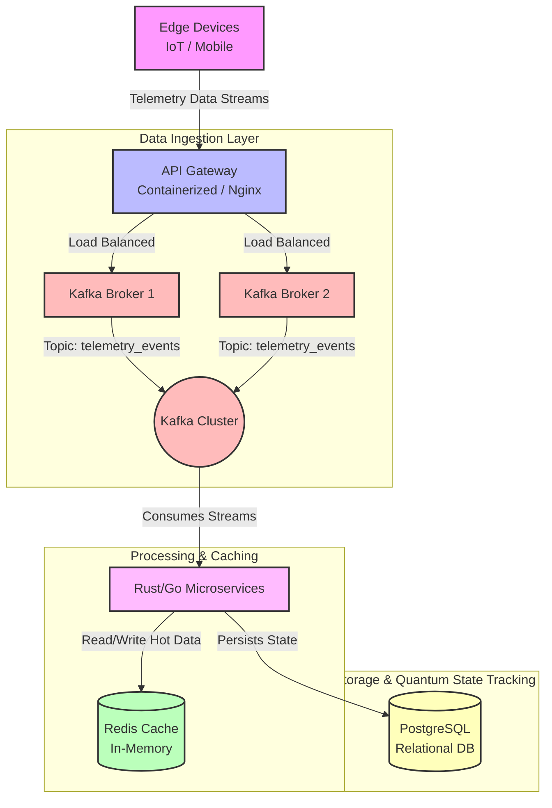

# Enterprise Topology

> [!NOTE]
> A static Mermaid.js diagram is provided below. For those who want to see dynamic animations, please check the [Animated Architecture](#animated-architecture) section.

This diagram illustrates how 'gravitational telemetry data' is ingested from an edge device, passes through a containerized gateway, a message broker, and an in-memory cache layer before reaching an ultra-fast compute node.

## Architecture Diagram

### Diagram Explanation

1. **Edge Devices**: Generates thousands of telemetry data points (e.g., gravitational sensor data) per second.
2. **API Gateway**: A containerized layer that receives the initial data and handles load balancing.
3. **Kafka Broker**: Chosen for its ability to handle massive data volumes. It routes data to processing services in real-time without any packet loss.
4. **Rust/Go Microservices**: These are ultra-fast compute nodes that consume data streams from Kafka.
5. **Redis**: An in-memory cache utilized for ultra-fast memory access needs during data processing (e.g., sessions or transient states).
6. **PostgreSQL**: Used as the primary database for persistent storage and executing complex relational queries (like quantum state tracking).

## Animated Architecture

> [!TIP]
> **Placeholder:** Our futuristic animated diagram (e.g., an Isometric .gif created via Figma/After Effects) will be added here.

*This image will visually demonstrate the live flow of data from one node to another using animations.*
