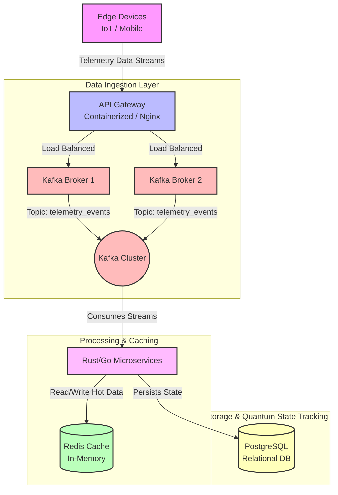

## Case Study: The Gravitational Data Pipeline

> Imagine an edge device—perhaps a deep-space satellite or an advanced terrestrial sensor—transmitting critical "gravitational telemetry data" every single millisecond. There are millions of such devices actively sending data simultaneously. 
> 
> How does a system handle this immense, relentless flood of data without crashing, slowing down, or losing a single packet?

This is where true **Enterprise Architecture** comes into play. As a System Architect, you must design a flow that is resilient, highly scalable, and completely secure.

### The Journey of a Data Packet

1. **The Arrival:** The device fires the data payload. Before it even reaches our internal network, it hits a containerized **API Gateway (NGINX/Envoy)**. This gateway verifies the device's identity using a Zero-Trust mTLS protocol.
2. **The Buffer:** The gateway doesn't try to process the data immediately. Instead, it acts as a load balancer and immediately offloads the payload to **Apache Kafka**. Kafka acts as an indestructible buffer, placing the event into a partitioned topic (`telemetry_events`).
3. **The Brain:** Waiting on the other side of Kafka are ultra-fast **Rust & Go Microservices**. They rapidly consume the streams. Because they are designed for extreme concurrency with zero garbage-collection pauses, they can process hundreds of thousands of events instantly.
4. **The Memory:** During processing, the microservices might need to check the previous state of the device. They instantly query an in-memory **Redis Cache** for sub-millisecond responses.
5. **The Vault:** Finally, the processed, structured data is persisted into a highly durable, ACID-compliant **PostgreSQL** database, ensuring the quantum state is tracked flawlessly.

---

## How It Was Built

Below is the architectural blueprint of this exact data pipeline. This illustrates the flawless execution of our case study.

